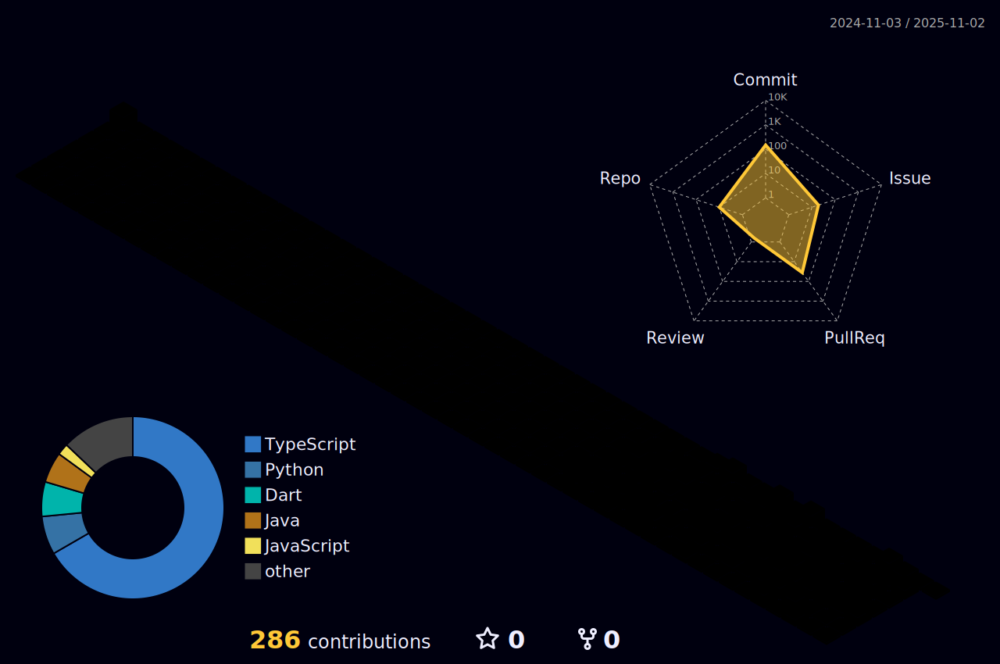

# 👻 I'm n1sp 👻
### Back-end–leaning full-stack by title, legacy C#/VB/VBA troubleshooter by day, modern tech & front-end learner by night. 

---
<table>
<tr>
<td width="50%" valign="top">

## 🛠 Main Skills
- Java / C#
- Python (simple scripts, web scraping)
- JavaScript / React / Next.js (in progress)
- Databases (Oracle / PostgreSQL / MySQL)

## 📊 Stats

 
 

---

## ⭐ ピン留めリポジトリ
Comming Soon ...

---

## 🚀 Try it now
Comming Soon ...

---
